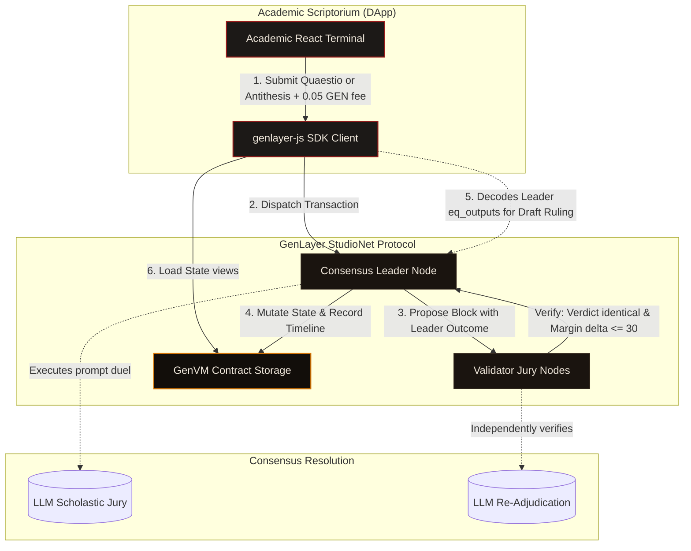

# DISPUTATIO

**A Scholastic AI Debate Coliseum on GenLayer governed by Intelligent Validator Consensus.**

Disputatio is an on-chain coliseum for formal logical debates, inspired by the scholastic disputation method of medieval universities. In this arena, ideas are rigorously scrutinized under the objective adjudication of an AI validator jury inside GenLayer's consensus loop. Users raise a *Quaestio* (topic), establish a *Thesis* (reigning argument), and challenge it with an *Antithesis* (refutation). The reigning Thesis holds by default unless the Antithesis is logically and empirically superior.

- **GitHub Repository:** [k-beee/Disputatio](https://github.com/k-beee/Disputatio)
- **Deployed Contract (StudioNet):** `0x6A9Ed3fA79775e162faC0EB35e79251DB03566Ba`
- **Live Deployment URL:** [https://disputatio-sooty.vercel.app/](https://disputatio-sooty.vercel.app/)

---

## Architectural Workflow

Disputatio uses a multi-agent stabilization model to settle subjective natural language debates trustlessly:



---

## Stand-Out Core Features

### 1. Game-Theoretic Burden of Proof (Incumbent Advantage)
Natural language debates are highly subjective, introducing consensus split risks. Disputatio addresses this in the arbiter prompt: the reigning Thesis stands by default (`DEFEND`) unless the Antithesis is *decisely superior* (`OVERTHROW`). By shifting borderline decisions away from the margin boundary, consensus remains stable.

### 2. Equivalence-With-Tolerance Consensus
The contract implements a two-tier stabilization architecture inside `_adjudicate`:
- **Categorical Verdict:** Validators must agree exactly on the text verdict (`DEFEND` vs `OVERTHROW`).
- **Subjective Margin:** Validators allow a numeric tolerance gap of up to **30 points** on the margin score (how decisively the overthrow was made). This prevents minor model sampling variations from causing consensus splits.

### 3. Scriptorium Treasury (0.05 GEN Fees)
To prevent spam, Sybil attacks, and frivolous consensus calls, creating a Quaestio and submitting an Antithesis require a transaction fee of **0.05 GEN** (50,000,000,000,000,000 Wei). Fees accumulate in the contract's balance and can be withdrawn securely by the contract deployer (Owner) via `withdraw_fees`.

### 4. Pre-Consensus UX (Leader Peeking)
Waiting for full blockchain consensus on complex AI transactions can degrade user experience. The frontend bypasses this by polling the leader node in real-time, base64-decoding the leader's proposed `eq_outputs` from the pending block receipt, and instantly displaying a *Draft Jury Verdict* to the user while validators are actively voting.

### 5. Defensive Input Sanitization & Ledger Bounding
- Input bounds are enforced in contract: topics (4-90 characters) and claims (10-500 characters).
- The historical event log is capped at `MAX_LEDGER_ENTRIES = 200` to prevent unbounded state growth and keep the storage gas footprint minimal.

---

## Repository Directory Map

```text
├── contracts/
│   └── disputatio.py        # Python Intelligent Contract (0.05 GEN Fee + Owner Withdrawal)
├── tests/
│   └── integration/
│       └── test_disputatio.py  # Lifecycle test suite for deployment, clash, and withdrawal
├── frontend/
│   ├── src/
│   │   ├── app/
│   │   │   ├── globals.css  # Scriptorium gothic manuscript style visual system
│   │   │   ├── layout.tsx
│   │   │   └── page.tsx     # Scriptorium coliseum dashboard linking hooks & modals
│   │   ├── components/      # UI components (Header, Modals, Empty/Error states)
│   │   ├── hooks/           # useWallet, useContractData, useTransaction hooks
│   │   └── lib/             # contract wrappers and address formatting utils
│   ├── package.json
│   ├── next.config.js
│   └── tsconfig.json
├── gltest.config.yaml       # GenLayer CLI network mapping configuration
└── README.md
```

---

## Scriptorium Setup & Run Commands

### 1. Compile & Lint Contract
Validate GenVM syntax and compiler compatibility:
```bash
pip install genvm-linter
genvm-lint contracts/disputatio.py
```

### 2. Execute Integration Tests
Verify the full debate lifecycle on StudioNet:
```bash
gltest tests/integration/ -v -s --network studionet
```

### 3. Run Frontend Locally
Launch the medieval scholastic dashboard on localhost:
```bash
cd frontend
npm install
npm run dev
```

---

## License

This project is licensed under the MIT License.
