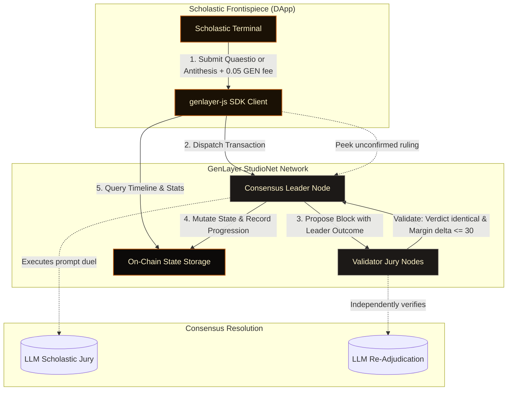

# Disputatio

**A Scholastic AI Debate Coliseum on GenLayer**

Disputatio is a decentralized coliseum for formal logical debates, inspired by the scholastic disputation method of medieval universities. In this arena, ideas are rigorously scrutinized on-chain under the guidance of a decentralized AI arbiter jury governed by GenLayer's intelligent contract consensus.

---

## The Scholastic Workflow

Formal disputes in Disputatio undergo a highly structured, game-theoretic process:

1. **Quaestio & Thesis Proposition:** A user (the Proponent) raises a *Quaestio* (a debate topic) and submits the initial *Thesis* (reigning claim). Establishing a Quaestio requires a minor disputation fee of **0.05 GEN**.
2. **The Antithesis Challenge:** Any opponent (the Challenger) can contest the reigning Thesis by submitting a formal logical refutation—the *Antithesis*. This also requires a fee of **0.05 GEN** to prevent spam and Sybil disputes.
3. **Scholastic AI Consensus:** The submission triggers validator consensus. Rather than relying on centralized APIs, the contract executes a natural language prompt duel natively within GenLayer validators.
4. **Incumbent Advantage (Philosophical Burden of Proof):** The reigning Thesis stands by default (`DEFEND`) unless the Antithesis is logically and empirically superior. This burden of proof stabilizes the consensus boundary.
5. **Validator Equivalence Check:** Validators verify the result. They must agree exactly on the categorical outcome (`DEFEND` or `OVERTHROW`) but allow a numeric tolerance on the subjective argument strength margin.
6. **Scholastic Progression:** If the Thesis is overthrown, the Challenger ascends the throne as the new Proponent, and the old Thesis is archived in the on-chain *Scholastic Progression Timeline*.

---

## Dialectical Flow

---

## Next Steps

1. **Intelligent Contract Development:** Implement `contracts/disputatio.py` with 0.05 GEN fee logic and owner fee withdrawal.
2. **Consensus Testing:** Run local/studionet integration tests with `gltest`.
3. **Scholastic UI Implementation:** Create a classy, manuscript-inspired dashboard interface.
